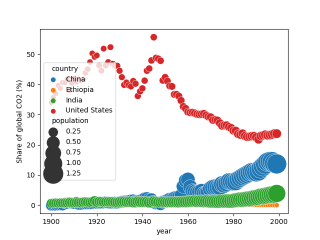
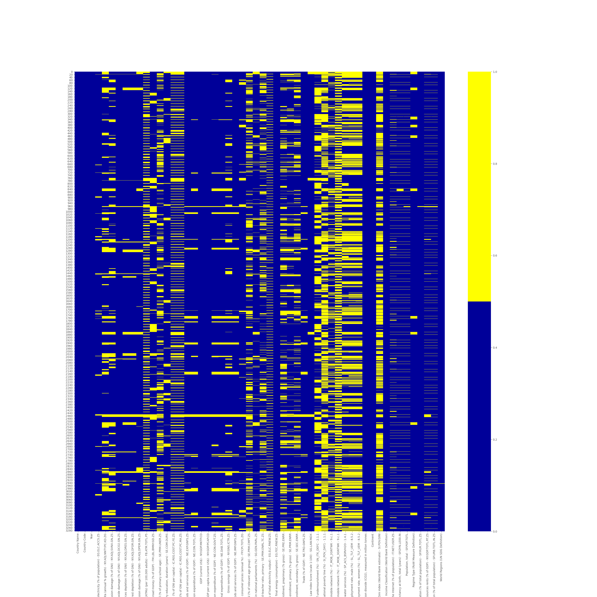

# DS_Hackathon_2021
Scripts and random experiments for the [TrueCue Women+Data Hackathon 2021](https://truecue.com/womenindata/hackathon-2021/).
Contains a collection of supporting datasets to complement the recommended dataset, some python scripts for cleaning and formatting and some simple graphs with matplotlib+seaborn. 

### Datasets/sources
- Hackathon dataset - TrueCue - https://github.com/joseph-TC/WD_Hackathon_repo
- Population - Gapminder - https://www.gapminder.org/topics/population-forecasts/
- Literacy - Harvard Business School - https://www.hbs.edu/businesshistory/courses/resources/historical-data-visualization/Pages/data-and-sources.aspx 
- Life expectancy - Our World in Data - https://ourworldindata.org/life-expectancy
- Human Development Index (HIHD) - Our World in Data - https://ourworldindata.org/human-development-index
- CO2, emissions - World Bank Data Bank - https://data.worldbank.org/indicator/EN.ATM.CO2E.PC

### Graphs 
#### Population over time
Population of four selected countries over time (1900-2000)

#### Share of global co2 emissions over time with population growth
Share of global co2 emissions of four selected countries over time with population size bubbles (1900-2000)

#### Share of population vs share of emissions over time, facet grid
Combination of two datasets, facet grid of four countries share of global population vs share of emissions over time (1900-2000)

#### Share of population vs share of emissions, selected years
Combination of the same two datasets, for a subsection of years to more clearly portray changes over time

#### Literacy over time
Literacy rates of four selected countries over time (1900-2000)

#### Life expectancy over time
Life expectancy at birth of four selected countries over time (1900-2000)

#### Human development index
[Human development index](http://hdr.undp.org/en/content/human-development-index-hdi) of four countries over time (1900-2000)

#### Missing data
Visualization of the missing data in the original dataset, yellow=missing

